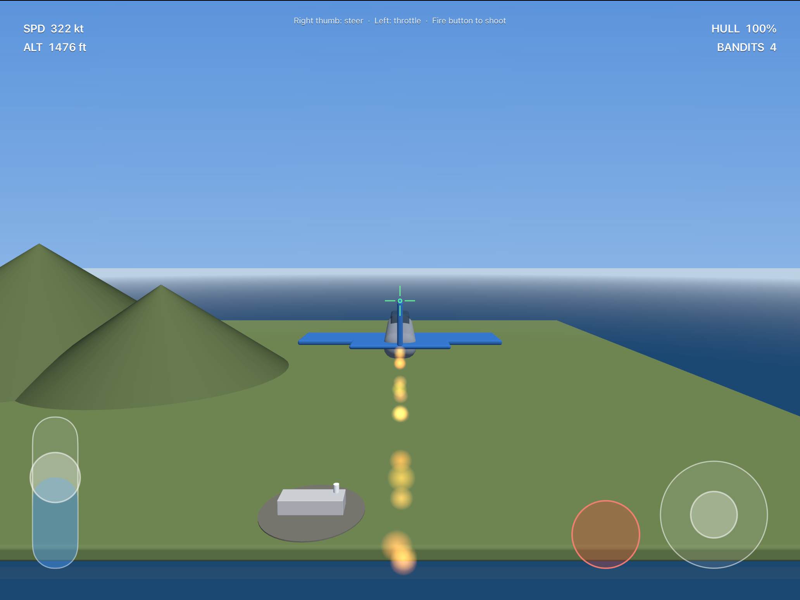

# Dogfight Adventures — SF Bay Area Flight Sim (iPad / SceneKit)

An arcade flight + dogfighting game set over a stylized San Francisco Bay Area.
Swift + SceneKit, built for iPad (universal — runs on iPhone too), landscape.



## What's in the MVP

- **Realistic-feel arcade flight model** — quaternion-based pitch/roll with a
  coordinated bank-to-turn, throttle-controlled airspeed (55–240 m/s), altitude
  ceiling/floor. Stable damped chase camera that banks slightly but never rolls
  fully (no nausea).
- **Bay Area world** — bay water, the SF peninsula / Marin / East Bay landmasses
  with hills, and recognizable landmarks built procedurally: **Golden Gate
  Bridge** (towers + deck + suspension cables, International Orange), **Bay
  Bridge**, **Transamerica Pyramid**, **Salesforce Tower**, **Alcatraz**, and a
  downtown financial-district skyline. Sky gradient + atmospheric haze.
- **Touch controls** — right-thumb virtual stick (roll + pitch), left vertical
  throttle, inboard fire button. Full multi-touch (steer + throttle + fire at
  once). Live HUD: airspeed (kt), altitude (ft), hull %, bandit count, crosshair.
- **Dogfighting** — forward guns with tracers, simple pursue-and-shoot enemy AI
  that steers toward you and fires when you're in its cone. Explosions on kills,
  hull damage + red flash when hit, respawn on death, skies kept populated.

**Out of scope (future versions, per the brief):** landing mechanics, scoring,
additional maps.

## Project layout

```
DogfightAdventures/Sources/
  AppDelegate.swift        App entry (UIKit window, no storyboard)
  GameViewController.swift  Owns scene/camera/loop; CADisplayLink game loop
  WorldBuilder.swift       Procedural Bay Area terrain + landmarks
  AircraftFactory.swift    Low-poly jet meshes + exhaust/explosion particles
  PlayerAircraft.swift     Arcade flight model
  EnemyAircraft.swift      Pursue-and-shoot AI
  WeaponSystem.swift       Projectiles + hit detection
  FlightHUD.swift          Touch controls + heads-up display
  MathUtils.swift          simd helpers
scripts/
  gen_project.rb           Regenerates the .xcodeproj from sources
  build.sh                 CPU-capped build (simulator by default)
  deploy.sh                Install + launch on a paired device
```

The `.xcodeproj` is generated by `scripts/gen_project.rb` (Ruby `xcodeproj`
gem). After adding/removing a source file, re-run it:

```bash
ruby scripts/gen_project.rb
```

## Building

Build CPU is capped at **≤20% of the M5 Max (18 cores)** per the brief: builds
run at `nice -n 15` with `-jobs 3` (3 cores = 16.7% theoretical ceiling).
Measured on a clean build: **~6% peak / ~2% mean** of the full machine.

```bash
# Simulator (default: iPad Pro 11-inch M5)
bash scripts/build.sh

# Specific destination
bash scripts/build.sh 'platform=iOS Simulator,name=iPad Pro 13-inch (M5)'

# Device (release, generic arm64)
CONFIG=Release bash scripts/build.sh 'generic/platform=iOS' CODE_SIGNING_ALLOWED=NO
```

## Running on the simulator

```bash
xcrun simctl boot "iPad Pro 13-inch (M5)"
xcrun simctl install booted build/DerivedData/Build/Products/Debug-iphonesimulator/DogfightAdventures.app
xcrun simctl launch booted com.cunliffe.dogfightadventures
```

## Deploying to a physical device (declan-ipad / declan-iphone)

> **Status:** deployed + running on declan-ipad. declan-iphone deploys the same
> way the moment its Developer Mode is on.

```bash
bash scripts/deploy.sh declan-ipad     # by name or UDID
```

`deploy.sh` is fully headless: it registers the device with App Store Connect via
an API key, builds + signs (CPU-capped), then installs and launches.

### Three one-time prerequisites per device

Apple gates physical-device deploys behind a few things that Tailscale's IP
reachability alone can't satisfy:

1. **Pairing/trust** — connect the device to this Mac via USB once and tap
   **Trust This Computer**. (Tailscale gives IP reachability but not the lockdown
   pairing record `devicectl` needs.)
2. **Developer Mode** — on the device: **Settings → Privacy & Security →
   Developer Mode → ON → restart → confirm**. This *cannot* be enabled remotely
   by design (requires a physical toggle + reboot).
3. **Device registered + signed** — handled automatically by `deploy.sh`:
   - Signs with team **`8W34JFWLTB`** (the active paid team; the `7478QA89YJ`
     "Apple Development" personal team has no usable account session).
   - Because the command-line Xcode account token isn't reliably available
     headlessly, signing uses an **App Store Connect API key**
     (`~/.appstoreconnect/private_keys/AuthKey_<id>.p8` + `issuer.txt`) via
     `xcodebuild -authenticationKey*`, which registers the device and mints a
     development provisioning profile without the GUI.

### Helpers

- `scripts/register_devices.mjs <keyId> "name:udid" …` — register devices with
  App Store Connect (ES256 JWT, no deps beyond Node).
- `scripts/install_when_ready.sh <udid> <label>` — wait for Developer Mode, then
  install the already-built signed app (no rebuild; the wildcard dev profile
  covers all registered devices).

## Swapping in marketplace city assets

The brief mentioned Sketchfab/TurboSquid assets. Those require accounts,
licensing, and payment that can't be acquired headlessly, so the world is
procedural for now. To swap in a real city model: drop a `.usdz`/`.dae` into
`DogfightAdventures/Resources/`, load it in `WorldBuilder.buildLandmarks()`, and
nothing else changes — the rest of the game only calls `WorldBuilder.build(into:)`.
